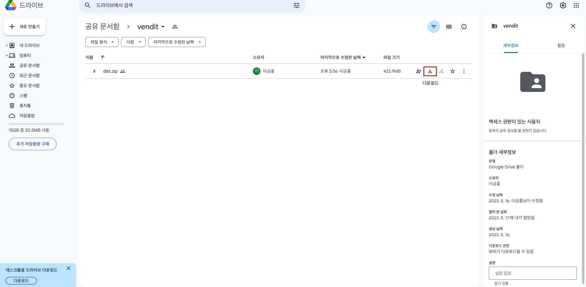

### 
 일렌트론 실행 파일 다운로드 주소 : https://drive.google.com/drive/folders/1Ox0BYpOlEXaIIx6aAbH0lHZLzmNSstEX?usp=sharing 

---
## 다운 및 실행 방법

1. 다운 로드 주소를 클릭
2. dist.zip 압축 해제 
3. 터미널을 열고 압축 해제 한 디렉토리로 이동
4. xattr -cr `압축 해제 된 디렉토리 경로`
5. mac-arm64 디렉토리 안에 있는 `log-place` 실행

## 목적
- GraphQL과 일렉트론을 공부하려고 제작했습니다.

## 기획 및 진행 과정
- 오프라인 상에서도 사진과 찍은 날짜, 위치 그리고 기록할 문장을 담는 프로그램을 기획 했습니다.
- 로컬 파일인 `.json` 파일을 읽고, 수정하는 것(`node의 fs`)이 필요하여 `craco` 라이브러리를 사용했습니다.
- 웹페이지로 먼저 제작하고 이후에 graphql 부분을 `fs`로 변경하였습니다. 이 과정에서 웹페이지 형식에서는 사진 크기가 제한이 있었지만, 일렉트론 앱에서는 제한을 없앴습니다.

## 소개 

### 방문한 숙소를 찍은 사진과 그 당시 느낀 감정을 한 줄로 작성하고, 업로드한 사진에 날짜와 위치정보가 있으면 자동으로 날짜와 구글맵으로 표기합니다. 오픈라인 상에서 일렉트론을 활용하여 추억을 남기기 위한 프로그램을 제작했습니다.

## 이용한 도구

###    
 

 
